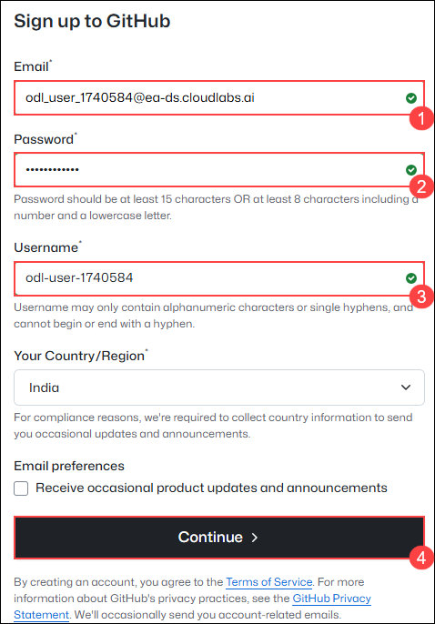
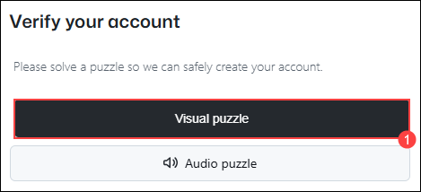

# 🐙 GitHub Sign-Up Guide

Welcome! This guide will walk you through the steps to create a new GitHub account so you can start sharing and collaborating on code.

---

## 📝 Step-by-Step Instructions

### 1. Visit GitHub

Go to the official GitHub website:  
👉 [https://github.com](https://github.com)

---

### 2. Start the Sign-Up Process

- Click the **"Sign up"** button at the top right.

   
---

### 3. Enter Your Details

Use the following details:

- **Email address** :- <inject key="AzureAdUserEmail"></inject>
- **Password** :- <inject key="AzureAdUserPassword"></inject>
- **Username** :- odl-user-

Then click **"Continue"**.

   
---

### 4. Verify Your Account

- Complete the puzzle to verify you're not a bot

   
- GitHub will send a verification code to your email
- Enter the code to continue

---

### 4a. Check Your Email in Outlook

1. Go to [https://outlook.office.com](https://outlook.office.com) or open the Outlook app.
2. Sign in with your Office 365 email address and password.
3. Once logged in, check your **Inbox** for an email from GitHub with your verification code.
4. If you don't see it, check your **Junk Email** or **Other** folders.
5. Copy the code from the email.
6. Return to the GitHub sign-up page and enter the code to continue.

---

### 5. Done! 🎉

You're now signed up and ready to:

- Create or fork repositories
- Push your code
- Collaborate with other developers

---

## 🚀 Next Steps

- [Create Your First Repository](https://docs.github.com/en/get-started/quickstart/create-a-repo)
- [Learn Git and GitHub Basics](https://docs.github.com/en/get-started/using-git)

---

## 🙋 Need Help?

Check out GitHub's official support:  
👉 [https://support.github.com](https://support.github.com)

---

Happy coding! 💻🌍
